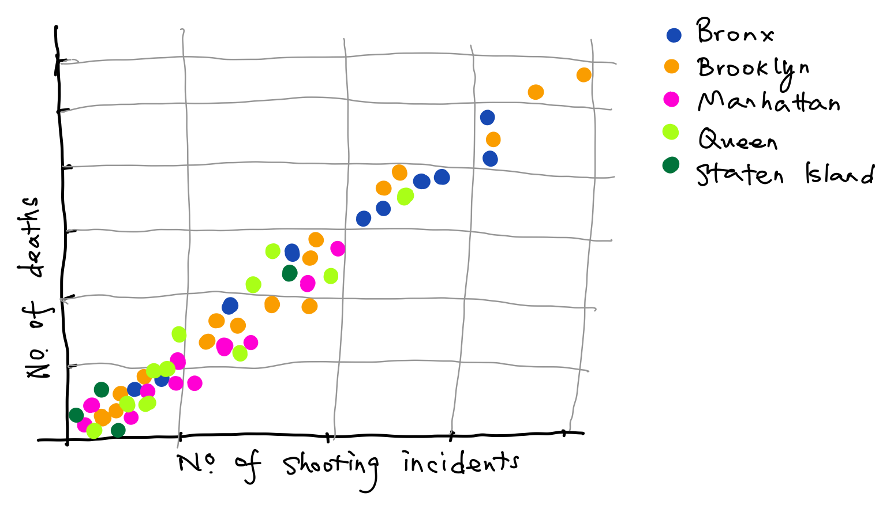
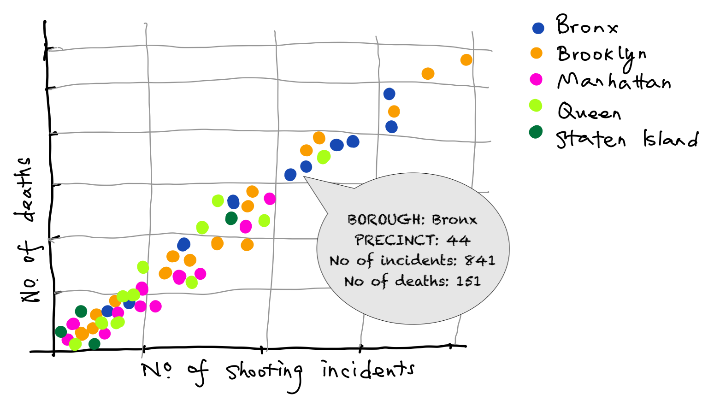
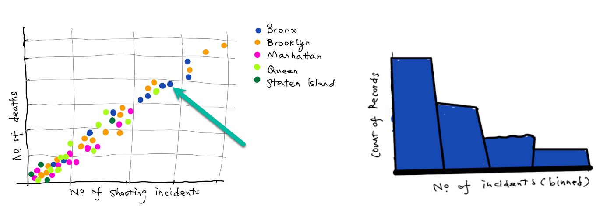
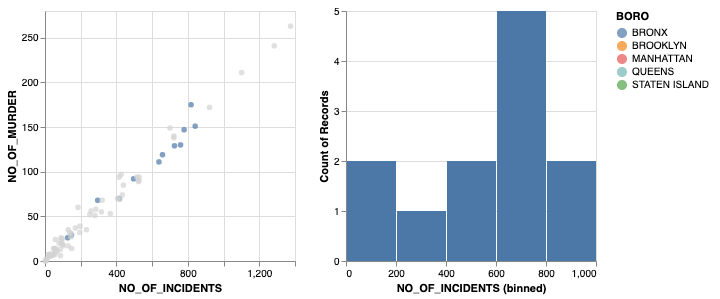

```{r setup, include=FALSE}
knitr::opts_chunk$set(echo = TRUE)
```

This report leverages **five sheets methodology** to create a preliminary visualization design.

# Brainstorming
## The data that we are working on

We take the historic data set that includes a list of every shooting incident occurred in NYC going back to 2006 through the end of the previous calendar year.
You may find the same CSV file used in this report as below :

<https://data.cityofnewyork.us/api/views/833y-fsy8/rows.csv>

And it contains the following data points:

```{r datasource, warning=FALSE, message=FALSE, echo=FALSE}
library(tidyverse)
library(lubridate)

url_in <- "https://data.cityofnewyork.us/api/views/833y-fsy8/rows.csv"
NYPD_shootings <- read_csv(url_in)
colnames_df <- colnames(NYPD_shootings)
colnames_df

```

## Goals
The goal for working on this data set is to analyze the number of incidents and deaths per precinct and borough recorded by NYPD since 2006 to previous calendar year.
These are the questions to answer:

* How many shooting incidents per precinct or borough in New York city? 
* How many deaths caused by shooting per precinct or borough in New York city?
* How many precincts are there in a borough? How are the incidents distributed in precincts?

## Tasks
* The purpose (high-level) - User can use the the visualization to have good understand about shooting incidents happened in New York city with details and the distribution.

* Navigation (middle-level)
  + User can view circles plotted on the visualization and look at the values on X-axis and Y-axis
  + User can also hover over a particular circle to find the details
  + User can select a borough by clicking on one circle belongs to it and view the details on the sub view plotted next to the main view

* Data attributes(low-level)
  + Marks are denoted by circles in the main view 
  + Each circle represents a few data attributes attached to it:
    1. Name of precinct
    2. Name of borough
    3. Number of shooting incidents in the precinct
    4. Number of deaths caused by shooting in the precinct

# Interations
3 iterations of low-fidelity prototypes are doodled down a few pieces of paper

## Low-fidelity Prototypes

{width=90%}

At the first iteration, a quick prototype is done with x-axis denoting *number of shooting incidents* and y-axis denoting *number of deaths from the*. Each circle represents a data mark of summarized data attributes for a precinct. 5 colors stand for 5 boroughs in New York city respectively.

{width=90%}

At the second iteration, an overlay pops up when mouse hovers over a circle. It will detail the data attributes for the particular precinct.

{width=90%}

The last iteration adds a sub view to link with the main view. When a borough is selected from main view, the histogram on sub view changes accordingly to give an idea how the incidents are distributed.

# Realization
## Altair implmentation
Above low-fidelity designs are finally realized into the final interactive high-fidelity design using Altair.
The Jyupyter notebook has been uploaded to Google Colaboratory for viewing at <https://colab.research.google.com/drive/1JQU-nRvBwN5sIEwgSKYSErkXcmQE9hvM?usp=sharing>

## Key elements of design
{width=90%}

Here are the key elements put into the design:

1. Selection:\
Once user selects interesting aspects of the data, a borough in this case, the main view make the data not selected less salient.
2. Semantic zoom:\
When a borough is selected, the right view drill down into data representing selected borough only.
3. Overview + Detail:\
Implemented *overview* and *detail* two views: zoom into specific subsets of the data (borough) in the *detail (right view)* to enable the analyst to explore their data; Show where that detail is with respect to the larger dataset through an *overview (left view)* indicating where the detail is focused.
4. Two view coordination:\
This technique allows users to interact with data in *main view (left)* and to see that data in *another view (right)*.

# Holistic Evaluation
In order to determine whether the visualization generally achieves its goals, we would like to to **Insight-Based Evaluation**.

## Goals and questions to answer
Lets recap the goals we want to archive in the beginning of this analysis

> The goal for working on this data set is to analyze the number of incidents and deaths per precinct and borough recorded by NYPD since 2006 to previous calendar year.
These are the questions to answer:

> * How many shooting incidents per precinct or borough in New York city? 
> * How many deaths caused by shooting per precinct or borough in New York city?
> * How many precincts are there in a borough? How are the incidents distributed in precincts?  


## The people recruited to answer these questions
Formative **Semi-structured interviews** conducted by having conversations with collaborators stemming from preplanned questions above.
3 software engineer/data scientists were interviewed with randomized questions above. *Adhoc questions* were also given.

1. [Jiang Yitao, Data scientist](https://www.linkedin.com/in/chiang1049/?originalSubdomain=sg)
2. [Huang Yongqian, Software engineer](https://www.linkedin.com/in/huangyongqian/?originalSubdomain=cn)
3. [Zhou Hongcheng, Data scientist](https://www.linkedin.com/in/hongcheng-zhou-asa-cfa-frm-a6a5b338/?originalSubdomain=sg)


## The interviews
Collaborators were given 15 minutes to learn about this analysis, including data source, goals and the visualizations.
Interview questions and answers were documented as below 

* Interview 1 - Jiang Yitao
  + **Can you make out of number of shooting incidents per precinct or borough in New York city?**\ *"Yes, I can easily find number of shooting incidents from x-axis. From the legend I understand each color denotes a borough"* 
  + **Can you find out what each data mark (circle) represent?**\ *"Well, I kind of figure it out by hovering mouse over them"*

* Interview 2 - Huang Yongqian
  + **Can you make out of number of shooting incidents per precinct or borough in New York city?**\ *"X-axis is number of shooting incidents, whereas y-axis is number of murders. Not hard to understand"* 
  + **Can you find out what each data mark (circle) represent?**\ *"When I click on a circle, it seems the ones in same color got selected, which means each circle denotes a precinct in the borough"*
  
* Interview 3 - Zhou Hongcheng
  + **Can you find out how many precincts are there in a borough?**\ *"Select a borough. Add up the number of datapoints each bar from the right view"* 
  + **How are the incidents distributed in precincts?**\ *"Each bin is plotted as a bar whose height corresponds to how many precincts are in that bin. Not hard to figure out - e.g.,Number of incidents are distributed either low or high in Staten Island. Low in Manhattan"* 
  + **Anything else you can see out of this vis?**\ *"You may want to look at the linear relationship between incidents and deaths"*
  
## Synthesis findings
To conclude, from the interviews, the visualization generally serves the purpose and archive the goals. Futher analysis can be done in exploring the linear model between shooting incidents and deaths.  
  
  
